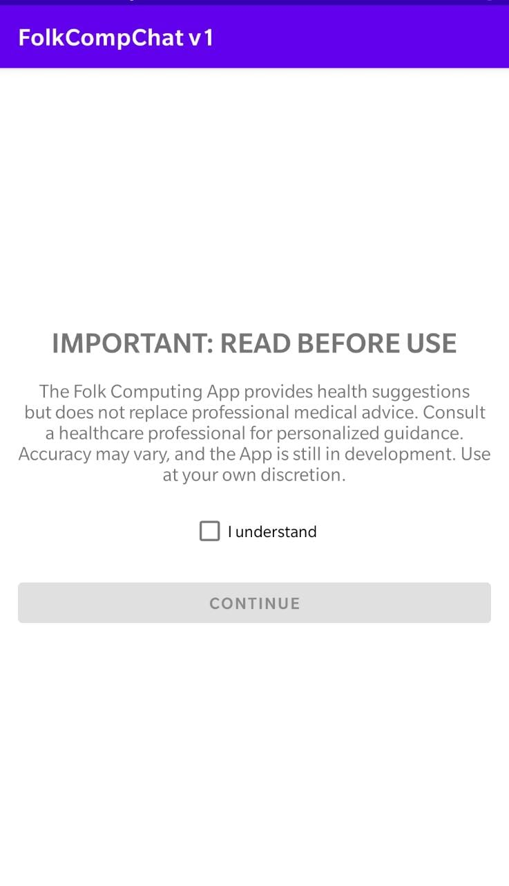
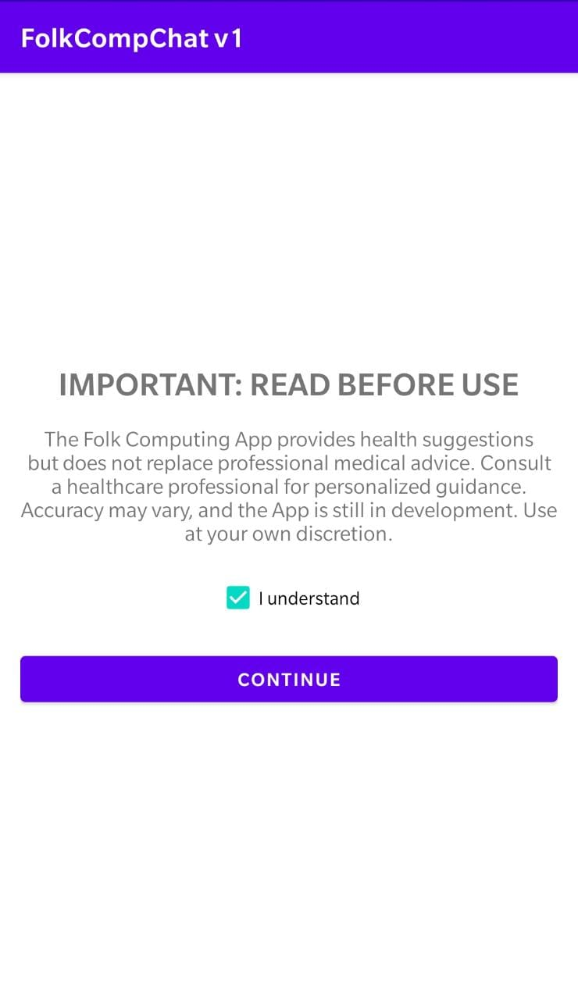
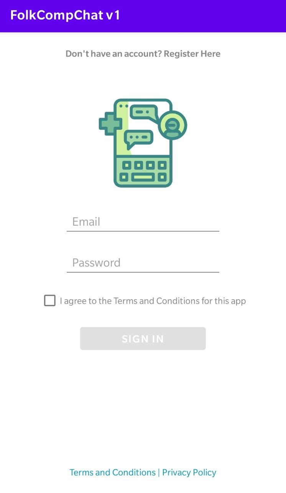
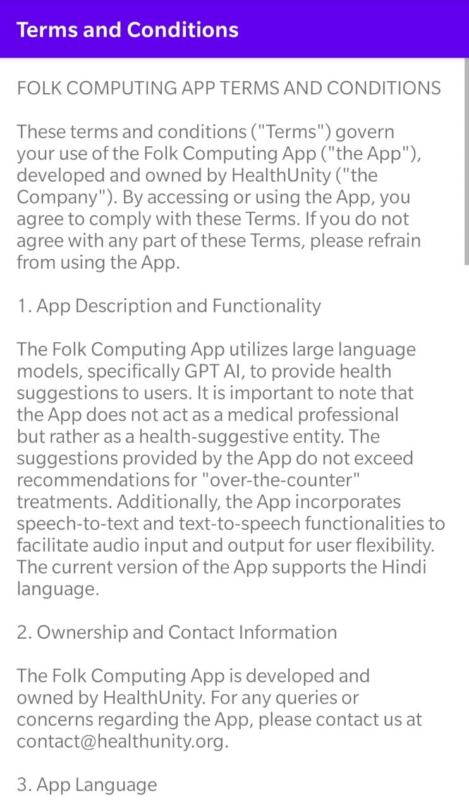
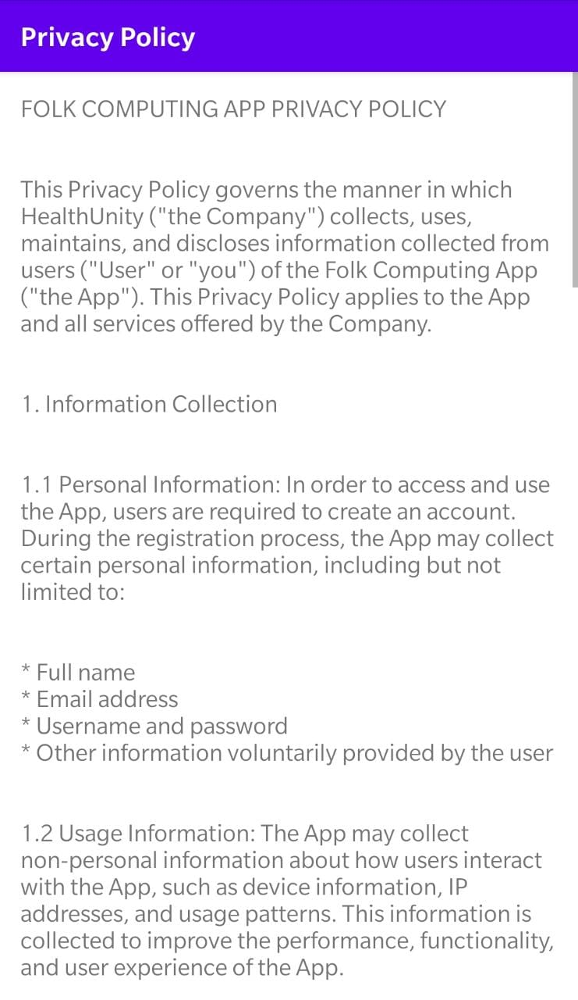
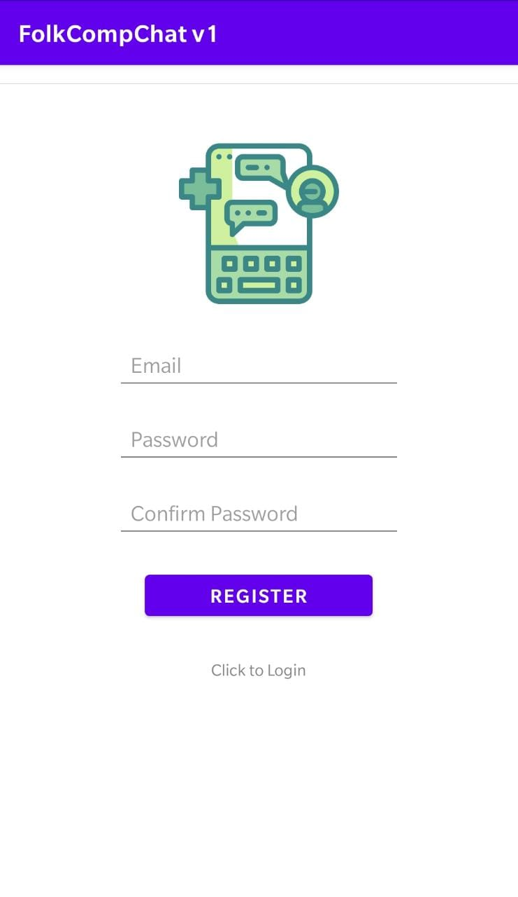
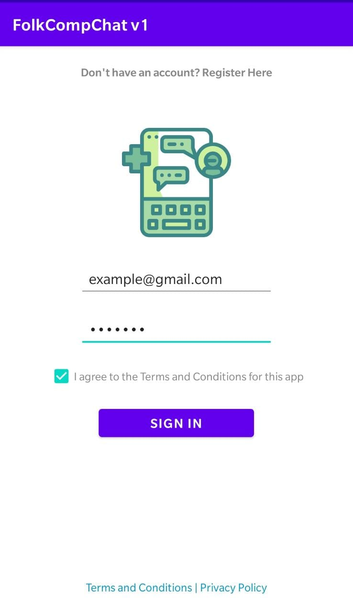
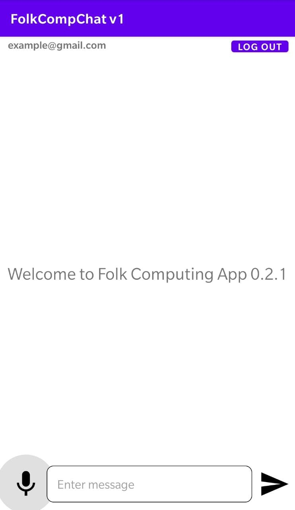
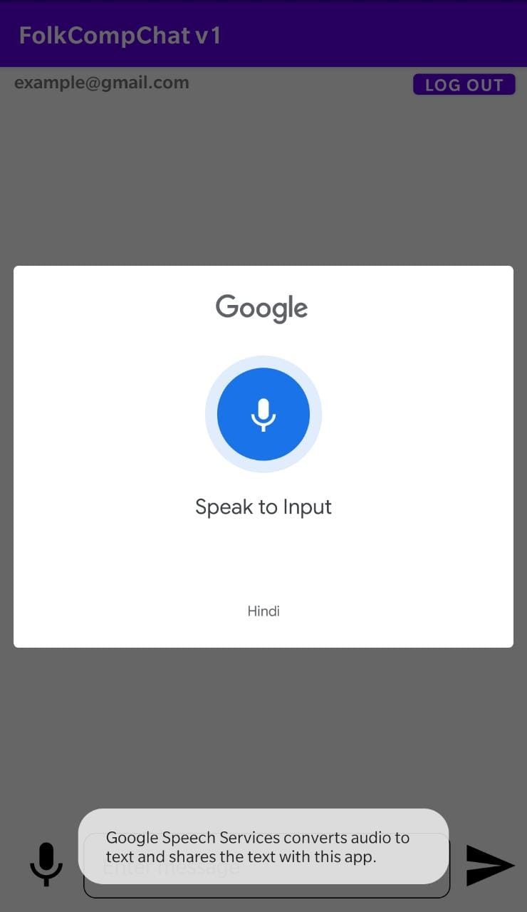
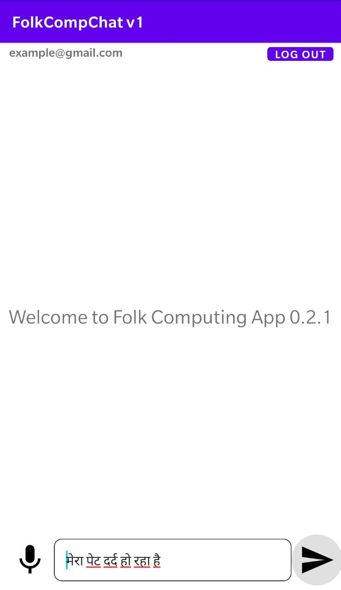

# Folk Computing v1.0 (alpha)
<!-- Table of Content -->
- [Problem Statement](#problem-statement)
- [Vision](#vision)
- [Solution](#solution)
- [Disclaimer](#disclaimer)
- [Downloading the App](#downloading-the-app)
- [Installation](#installation)
- [Terms and Conditions](TC.md)
- [Privacy Policy](PP.md)
- [Feedback](#feedback)


## Problem Statement
There is a lack of a culturally sensitive and multimedia-dominant accessible computer application to bridge the technology gap between affluent and impoverished populations, particularly those residing in rural areas with limited literacy.

## Vision
Our vision is to enhance the accessibility of health services by leveraging technology and AI. To achieve this, we aim to broaden the reach of our resources by incorporating multiple languages. Additionally, we prioritize the integration of speech-to-text technologies as a key aspect of future applications, allowing individuals with limited literacy and disabilities to access and benefit from the same health-focused application as others

## Solution
The Folk Computing project is an Android Based application with a chat interface powered by large language models, enabling users to access the health model in multiple languages, allowing speech input and output. The current ```alpha``` version specifically uses GPT AI and only support ```Hindi``` language. 

## Disclaimer
The Folk Computing App provides health suggestions but does not replace professional medical advice. Consult a healthcare professional for personalized guidance. Accuracy may vary, and the App is still in development. Use at your own discretion. 

For more information, refer to the [Terms and Conditions](T%26C.md) and [Privacy Policy](PP.md).

## Downloading the App
By downloading the Folk Computing App, you agree to the [Terms and Conditions](T%26C.md) and [Privacy Policy](PP.md). You are acknowledging that the App is still in development and may not be accurate. You are also acknowledging that the App is not a replacement for professional medical advice and that you should consult a healthcare professional for personalized guidance. The application only works as a suggestion tool and does not provide any medical advice.

## Installation
For installation, fill out the [Google Form](https://forms.gle/6vZXP3bYSEDc8vbw8) and you will be sent a link to download the app.

After downloading the app, you will need to enable installation from unknown sources. To do this, go to ```Settings > Security > Unknown Sources``` and enable it.

After enabling installation from unknown sources, you can install the app by clicking on the downloaded file and clicking ```Install```.

#### Disclaimer Screen
After installation, you can open the app and use it. You will be greeted with a such screen:
<!-- Center -->
<p align="center">
  
  
</p>

After reading the disclaimer, click ```I understand``` and then click on ```continue``` to continue. 

#### Login Screen
You will be greeted with a login screen as such:
<p align="center">
  
</p>

At bottom of the screen, you can find ```Terms and Conditions``` and ```Privacy Policy``` links. Click on them to read them. 
<p align="center">
  
  
</p>

#### New Users
For new users, you can find a ```Register here``` button at top of the login screen. Click on it to register as a new user. You will be greeted with a screen as such: 
<p align="center">
  
</p>

Enter your name, email, password, and confirm password. Then click on ```Register``` to register. You will be taken to the chat screen directly.

#### Existing Users
For existing users, you can enter your email and password and click on ```Sign In``` to login. You will also need to check the ```I agree to the Terms and Conditions for this app``` checkbox. You will be taken to the chat screen directly.
<p align="center">
  
</p>

#### Chat Screen
In the chat screen, you click on the ```Mic``` button to start speaking. 
<p align="center">
  
  
</p>

Note that the app only supports ```Hindi``` language. You can speak in ```Hindi``` and the app will respond in ```Hindi```.

After done speaking, click on the ```Mic``` button again to stop speaking. The app will then process your speech and show it in the ```Enter Message``` box. Click on the ```Send``` button to send the message.
<p align="center">
  
</p>

The app will then process your message and show the response in the chat screen.

The app will start speaking the response automatically in ```Hindi```. 

To re-listen to the response, long press on the message and click on the ```Speak Now``` button. The app will start speaking the response again. The demonstration is shown below:
<p align=center>
    <video src="./install-steps/9.mp4" width="150" height="300" controls preload></video>
</p>

## Feedback
We are still in development and would love to hear your feedback. The alpha version for testing purposes and only supports ```Hindi``` language. We are working on adding more languages and features.

Please fill out the [Google Form](https://forms.gle/jJbTTDPdZwTyUsar9) to provide feedback.